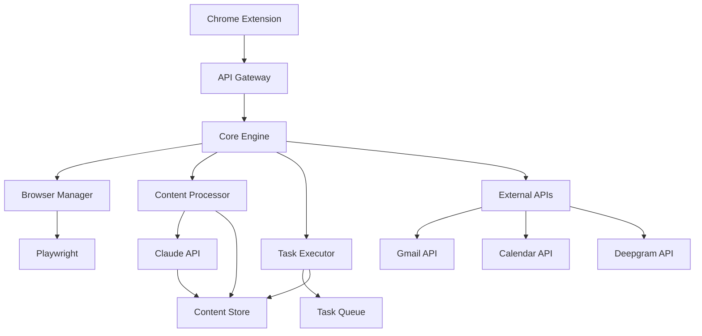

# SmartBrowser: Browser Automation Assistant - Technical Implementation Plan

## Table of Contents
1. [Executive Summary](#executive-summary)
2. [MVP Implementation Strategy](#mvp-implementation-strategy)
3. [Proposed File Structure](#proposed-file-structure)
4. [Technical Architecture](#technical-architecture)
5. [Error Handling and Edge Cases](#error-handling-and-edge-cases)
6. [Success Criteria for Testing](#success-criteria-for-testing)
7. [Rollback Strategy](#rollback-strategy)
8. [Implementation Phases](#implementation-phases)
9. [Security Implementation](#security-implementation)
10. [Performance Optimization](#performance-optimization)

## Executive Summary

This plan details the step-by-step implementation of SmartBrowser, a browser automation assistant that can open pages, summarize content, and respond to goal prompts like "find me hotels in Paris next weekend". The MVP focuses on three core capabilities:

1. **Page Navigation & Content Extraction**: Using Playwright for browser automation
2. **Content Summarization**: Leveraging Claude API for intelligent content processing
3. **Goal-Based Task Execution**: Natural language understanding for user intents

**Technology Stack (Based on Research)**:
- Browser Automation: Playwright
- AI Processing: Claude API
- Task Queue: Redis + Node.js Queue System
- Content Extraction: Readability.js + youtube-transcript-api
- Storage: Hybrid (IndexedDB + chrome.storage)
- Voice Input: Deepgram API (future enhancement)

## MVP Implementation Strategy

### Core MVP Features
The MVP will demonstrate three key workflows:

1. **Page Summarization**: User opens a webpage → SmartBrowser extracts content → Claude summarizes
2. **Simple Goal Execution**: User says "find hotels in Paris" → SmartBrowser navigates to booking sites → Extracts relevant data → Presents options
3. **Tab Management**: Track browsing context → Provide intelligent suggestions based on current session

### Implementation Order
1. **Foundation Layer** (Week 1-2): Browser automation + basic Claude integration
2. **Content Processing** (Week 3-4): Summarization + data extraction
3. **Goal Execution** (Week 5-6): Task planning + execution engine
4. **Integration** (Week 7-8): Chrome extension + polishing

## Proposed File Structure

```
SmartBrowser/
├── src/
│   ├── core/
│   │   ├── browser/
│   │   │   ├── playwright-manager.js       # Browser automation controller
│   │   │   ├── page-controller.js          # Individual page management
│   │   │   ├── context-manager.js          # Browser context isolation
│   │   │   └── session-storage.js          # Session data management
│   │   ├── ai/
│   │   │   ├── claude-client.js            # Claude API integration
│   │   │   ├── context-builder.js          # Context preparation for Claude
│   │   │   ├── response-parser.js          # Parse and validate Claude responses
│   │   │   └── prompt-templates.js         # Structured prompts library
│   │   ├── content/
│   │   │   ├── extractors/
│   │   │   │   ├── base-extractor.js       # Abstract base class
│   │   │   │   ├── article-extractor.js    # Readability.js implementation
│   │   │   │   ├── youtube-extractor.js    # YouTube transcript extraction
│   │   │   │   ├── social-extractor.js     # Twitter, LinkedIn, etc.
│   │   │   │   └── ecommerce-extractor.js  # Product pages, reviews
│   │   │   ├── processors/
│   │   │   │   ├── summarizer.js           # Content summarization
│   │   │   │   ├── entity-extractor.js     # Named entity recognition
│   │   │   │   └── intent-classifier.js    # User intent detection
│   │   │   └── storage/
│   │   │       ├── content-store.js        # IndexedDB wrapper
│   │   │       ├── cache-manager.js        # Intelligent caching
│   │   │       └── history-tracker.js      # Browse history analysis
│   │   ├── tasks/
│   │   │   ├── queue/
│   │   │   │   ├── task-queue.js           # Redis-based task queue
│   │   │   │   ├── worker-pool.js          # Worker process management
│   │   │   │   └── scheduler.js            # Task scheduling logic
│   │   │   ├── executors/
│   │   │   │   ├── base-executor.js        # Abstract task executor
│   │   │   │   ├── search-executor.js      # Search task implementation
│   │   │   │   ├── booking-executor.js     # Hotel/flight booking tasks
│   │   │   │   ├── shopping-executor.js    # E-commerce tasks
│   │   │   │   └── social-executor.js      # Social media tasks
│   │   │   └── planners/
│   │   │       ├── goal-parser.js          # Natural language goal parsing
│   │   │       ├── step-generator.js       # Break goals into steps
│   │   │       └── execution-monitor.js    # Track task progress
│   │   └── utils/
│   │       ├── logger.js                   # Structured logging
│   │       ├── config.js                   # Configuration management
│   │       ├── validator.js                # Input validation
│   │       ├── retry-handler.js            # Exponential backoff retry
│   │       └── security.js                 # Security utilities
│   ├── extension/
│   │   ├── manifest.json                   # Chrome extension manifest
│   │   ├── background/
│   │   │   ├── service-worker.js           # Main background process
│   │   │   ├── tab-manager.js              # Tab lifecycle management
│   │   │   └── message-handler.js          # Cross-context messaging
│   │   ├── content/
│   │   │   ├── content-script.js           # Injected page scripts
│   │   │   ├── dom-observer.js             # DOM change monitoring
│   │   │   └── page-analyzer.js            # Real-time page analysis
│   │   ├── popup/
│   │   │   ├── popup.html                  # Extension popup UI
│   │   │   ├── popup.js                    # Popup functionality
│   │   │   └── popup.css                   # Popup styling
│   │   └── options/
│   │       ├── options.html                # Settings page
│   │       ├── options.js                  # Settings functionality
│   │       └── options.css                 # Settings styling
│   ├── api/
│   │   ├── routes/
│   │   │   ├── tasks.js                    # Task management endpoints
│   │   │   ├── content.js                  # Content processing endpoints
│   │   │   ├── auth.js                     # Authentication endpoints
│   │   │   └── health.js                   # Health check endpoints
│   │   ├── middleware/
│   │   │   ├── auth-middleware.js          # JWT validation
│   │   │   ├── rate-limiter.js             # Request rate limiting
│   │   │   ├── cors-handler.js             # CORS configuration
│   │   │   └── error-handler.js            # Global error handling
│   │   └── services/
│   │       ├── oauth-service.js            # OAuth2 implementation
│   │       ├── encryption-service.js       # Token encryption
│   │       └── notification-service.js     # User notifications
│   └── integrations/
│       ├── gmail/
│       │   ├── gmail-client.js             # Gmail API client
│       │   ├── email-parser.js             # Email content extraction
│       │   └── calendar-sync.js            # Calendar integration
│       ├── apis/
│       │   ├── deepgram-client.js          # Voice-to-text (future)
│       │   ├── claude-api.js               # Claude API wrapper
│       │   └── external-apis.js            # Third-party API clients
│       └── webhooks/
│           ├── webhook-server.js           # Webhook handling
│           └── event-processor.js          # Event processing
├── tests/
│   ├── unit/
│   │   ├── core/                           # Core module tests
│   │   ├── content/                        # Content processing tests
│   │   ├── tasks/                          # Task execution tests
│   │   └── utils/                          # Utility function tests
│   ├── integration/
│   │   ├── browser-automation.test.js      # Playwright integration tests
│   │   ├── claude-integration.test.js      # Claude API integration
│   │   ├── content-extraction.test.js      # Content processing pipeline
│   │   └── task-execution.test.js          # End-to-end task tests
│   ├── e2e/
│   │   ├── scenarios/
│   │   │   ├── hotel-search.test.js        # Hotel booking scenario
│   │   │   ├── page-summary.test.js        # Page summarization
│   │   │   └── tab-management.test.js      # Tab context management
│   │   └── fixtures/
│   │       ├── test-pages/                 # Mock pages for testing
│   │       └── mock-responses/             # API response mocks
│   └── performance/
│       ├── load-tests/                     # Load testing scripts
│       ├── memory-tests/                   # Memory usage tests
│       └── benchmarks/                     # Performance benchmarks
├── config/
│   ├── development.json                    # Development configuration
│   ├── production.json                     # Production configuration
│   ├── test.json                           # Test configuration
│   └── docker/
│       ├── Dockerfile                      # Container configuration
│       ├── docker-compose.yml              # Multi-service setup
│       └── nginx.conf                      # Reverse proxy config
├── docs/
│   ├── api/                                # API documentation
│   ├── architecture/                       # System architecture docs
│   ├── deployment/                         # Deployment guides
│   └── user-guide/                         # End-user documentation
├── scripts/
│   ├── build.js                           # Build automation
│   ├── deploy.js                          # Deployment scripts
│   ├── migrate.js                         # Database migrations
│   └── test-runner.js                     # Test execution scripts
├── package.json                           # Node.js dependencies
├── package-lock.json                      # Locked dependency versions
├── .env.example                           # Environment variables template
├── .gitignore                             # Git ignore rules
├── README.md                              # Project overview
└── CHANGELOG.md                           # Version history
```

## Technical Architecture

### System Architecture Overview

```
┌─────────────────────────────────────────────────────────────────┐
│                     Chrome Extension                             │
├─────────────────────────────────────────────────────────────────┤
│  ┌─────────────┐  ┌─────────────┐  ┌─────────────┐              │
│  │   Popup     │  │   Content   │  │ Background  │              │
│  │     UI      │  │   Script    │  │   Worker    │              │
│  └─────────────┘  └─────────────┘  └─────────────┘              │
└─────────────────────────────────────────────────────────────────┘
                             │
                             ▼
┌─────────────────────────────────────────────────────────────────┐
│                      API Gateway                                │
├─────────────────────────────────────────────────────────────────┤
│  ┌─────────────┐  ┌─────────────┐  ┌─────────────┐              │
│  │    Auth     │  │Rate Limiter │  │    CORS     │              │
│  │ Middleware  │  │             │  │  Handler    │              │
│  └─────────────┘  └─────────────┘  └─────────────┘              │
└─────────────────────────────────────────────────────────────────┘
                             │
                             ▼
┌─────────────────────────────────────────────────────────────────┐
│                    Core Processing Engine                       │
├─────────────────────────────────────────────────────────────────┤
│  ┌─────────────┐  ┌─────────────┐  ┌─────────────┐              │
│  │   Browser   │  │   Content   │  │    Task     │              │
│  │ Automation  │  │ Processing  │  │  Execution  │              │
│  │(Playwright) │  │  (Claude)   │  │   Engine    │              │
│  └─────────────┘  └─────────────┘  └─────────────┘              │
└─────────────────────────────────────────────────────────────────┘
                             │
                             ▼
┌─────────────────────────────────────────────────────────────────┐
│                   External Integrations                        │
├─────────────────────────────────────────────────────────────────┤
│  ┌─────────────┐  ┌─────────────┐  ┌─────────────┐              │
│  │ Claude API  │  │  Gmail API  │  │   Storage   │              │
│  │             │  │             │  │  (IndexedDB │              │
│  │             │  │             │  │   + Redis)  │              │
│  └─────────────┘  └─────────────┘  └─────────────┘              │
└─────────────────────────────────────────────────────────────────┘
```

### Data Flow Architecture

#### 1. Page Summarization Flow
```
User opens webpage → Content Script extracts DOM → 
Background Worker processes → Claude API summarizes → 
Result cached in IndexedDB → User receives summary
```

#### 2. Goal Execution Flow
```
User inputs goal → Goal Parser extracts intent → 
Step Generator creates action plan → Task Queue schedules steps → 
Browser Automation executes → Results aggregated → 
Claude formats response → User receives results
```

#### 3. Context Management Flow
```
Tab changes tracked → Page content extracted → 
Historical context built → Claude receives context → 
Recommendations generated → User notified of suggestions
```

### Component Interaction Diagram



### API Integration Points

#### 1. Claude API Integration
```javascript
// Context preparation for Claude
const claudeContext = {
  system: "You are SmartBrowser, an intelligent browser automation assistant.",
  messages: [
    {
      role: "user",
      content: `
        Current page: ${pageTitle}
        Content summary: ${contentSummary}
        User goal: ${userGoal}
        Recent tabs: ${recentTabsContext}
        
        Please provide specific actions to achieve this goal.
      `
    }
  ]
};
```

#### 2. Task Queue Design
```javascript
// Redis-based task queue with priority
class TaskQueue {
  constructor(redisClient) {
    this.redis = redisClient;
    this.queues = {
      critical: 'tasks:critical',    // <5s response needed
      high: 'tasks:high',            // <30s response needed
      normal: 'tasks:normal',        // <2min response needed
      low: 'tasks:low'               // Background processing
    };
  }
  
  async enqueue(taskData, priority = 'normal') {
    const task = {
      id: uuidv4(),
      type: taskData.type,
      payload: taskData.payload,
      createdAt: Date.now(),
      priority: priority,
      retryCount: 0,
      maxRetries: 3
    };
    
    await this.redis.lpush(this.queues[priority], JSON.stringify(task));
    return task.id;
  }
}
```

## Error Handling and Edge Cases

### 1. Authentication Failures

#### OAuth Token Expiration
```javascript
class TokenManager {
  async handleTokenExpiration(userId, apiName) {
    try {
      // Attempt silent refresh
      const newToken = await this.refreshToken(userId, apiName);
      await this.securelyStoreToken(userId, apiName, newToken);
      return newToken;
    } catch (refreshError) {
      // Redirect to re-authorization
      await this.initiateReauthorization(userId, apiName);
      throw new AuthenticationError('Re-authorization required');
    }
  }
  
  async refreshToken(userId, apiName) {
    const refreshToken = await this.getRefreshToken(userId, apiName);
    if (!refreshToken) {
      throw new Error('No refresh token available');
    }
    
    const response = await this.makeTokenRefreshRequest(refreshToken);
    if (!response.ok) {
      throw new Error('Token refresh failed');
    }
    
    return response.access_token;
  }
}
```

#### API Rate Limiting
```javascript
class RateLimitHandler {
  constructor() {
    this.rateLimits = new Map();
    this.backoffMultiplier = 2;
    this.maxBackoffTime = 300000; // 5 minutes
  }
  
  async handleRateLimit(apiName, retryAfter) {
    const currentBackoff = this.rateLimits.get(apiName) || 1000;
    const nextBackoff = Math.min(
      currentBackoff * this.backoffMultiplier,
      this.maxBackoffTime
    );
    
    this.rateLimits.set(apiName, nextBackoff);
    
    // Wait for the longer of rate limit or backoff time
    const waitTime = Math.max(retryAfter * 1000, currentBackoff);
    await this.sleep(waitTime);
  }
}
```

### 2. Network Timeouts

#### Browser Automation Timeouts
```javascript
class PlaywrightManager {
  async safeNavigate(url, options = {}) {
    const timeout = options.timeout || 30000;
    const retries = options.retries || 3;
    
    for (let attempt = 1; attempt <= retries; attempt++) {
      try {
        await this.page.goto(url, { 
          timeout,
          waitUntil: 'domcontentloaded'
        });
        
        // Wait for essential elements to load
        await this.page.waitForSelector('body', { timeout: 5000 });
        return true;
        
      } catch (error) {
        if (attempt === retries) {
          throw new NavigationError(`Failed to navigate to ${url}`, error);
        }
        
        // Exponential backoff
        await this.sleep(Math.pow(2, attempt) * 1000);
      }
    }
  }
  
  async handlePageTimeout(url, error) {
    // Log timeout details
    this.logger.warn('Page timeout', { url, error: error.message });
    
    // Try to extract partial content
    try {
      const partialContent = await this.page.content();
      return { partial: true, content: partialContent };
    } catch (extractError) {
      throw new ContentExtractionError('Complete page load failure');
    }
  }
}
```

#### API Request Timeouts
```javascript
class ApiClient {
  async makeRequest(endpoint, options = {}) {
    const controller = new AbortController();
    const timeout = options.timeout || 10000;
    
    const timeoutId = setTimeout(() => {
      controller.abort();
    }, timeout);
    
    try {
      const response = await fetch(endpoint, {
        ...options,
        signal: controller.signal
      });
      
      clearTimeout(timeoutId);
      
      if (!response.ok) {
        throw new ApiError(`HTTP ${response.status}: ${response.statusText}`);
      }
      
      return await response.json();
      
    } catch (error) {
      clearTimeout(timeoutId);
      
      if (error.name === 'AbortError') {
        throw new TimeoutError(`Request to ${endpoint} timed out`);
      }
      
      throw error;
    }
  }
}
```

### 3. DOM Parsing Failures

#### Dynamic Content Handling
```javascript
class ContentExtractor {
  async extractWithFallbacks(page, extractors) {
    const results = [];
    
    for (const extractor of extractors) {
      try {
        const content = await extractor.extract(page);
        if (this.isContentValid(content)) {
          results.push({ extractor: extractor.name, content });
        }
      } catch (error) {
        this.logger.warn(`Extractor ${extractor.name} failed`, error);
        continue;
      }
    }
    
    if (results.length === 0) {
      throw new ContentExtractionError('All extractors failed');
    }
    
    // Return best result based on content quality score
    return this.selectBestContent(results);
  }
  
  async handleDynamicContent(page, selector, timeout = 10000) {
    try {
      // Wait for dynamic content to load
      await page.waitForSelector(selector, { timeout });
      
      // Additional wait for AJAX requests to complete
      await page.waitForLoadState('networkidle');
      
      return await page.$(selector);
      
    } catch (error) {
      // Try alternative selectors
      const alternativeSelectors = this.getAlternativeSelectors(selector);
      
      for (const altSelector of alternativeSelectors) {
        try {
          await page.waitForSelector(altSelector, { timeout: 5000 });
          return await page.$(altSelector);
        } catch (altError) {
          continue;
        }
      }
      
      throw new DynamicContentError(`Could not locate dynamic content: ${selector}`);
    }
  }
}
```

### 4. CAPTCHA Handling

#### CAPTCHA Detection and Response
```javascript
class CaptchaHandler {
  async detectCaptcha(page) {
    const captchaSelectors = [
      '.g-recaptcha',
      '#captcha',
      '[data-captcha]',
      'iframe[src*="recaptcha"]',
      '.h-captcha'
    ];
    
    for (const selector of captchaSelectors) {
      const element = await page.$(selector);
      if (element) {
        return {
          detected: true,
          type: this.identifyCaptchaType(selector),
          element: element
        };
      }
    }
    
    return { detected: false };
  }
  
  async handleCaptcha(page, captchaInfo) {
    switch (captchaInfo.type) {
      case 'recaptcha':
        return await this.handleRecaptcha(page, captchaInfo.element);
      
      case 'hcaptcha':
        return await this.handleHCaptcha(page, captchaInfo.element);
      
      default:
        // Notify user intervention required
        await this.requestUserIntervention(page, captchaInfo);
        return await this.waitForCaptchaSolution(page);
    }
  }
  
  async requestUserIntervention(page, captchaInfo) {
    const notification = {
      type: 'captcha_detected',
      message: 'CAPTCHA detected. Please solve it to continue.',
      page: page.url(),
      timestamp: Date.now()
    };
    
    await this.notificationService.send(notification);
    
    // Pause automation until user solves CAPTCHA
    await this.pauseAutomation(page);
  }
}
```

### 5. Memory Management

#### Browser Context Cleanup
```javascript
class MemoryManager {
  constructor() {
    this.contexts = new Map();
    this.cleanupInterval = 30 * 60 * 1000; // 30 minutes
    this.maxMemoryUsage = 500 * 1024 * 1024; // 500MB
  }
  
  async monitorMemoryUsage() {
    setInterval(async () => {
      const memoryUsage = process.memoryUsage();
      
      if (memoryUsage.heapUsed > this.maxMemoryUsage) {
        await this.performMemoryCleanup();
      }
      
      await this.cleanupInactiveContexts();
    }, 60000); // Check every minute
  }
  
  async performMemoryCleanup() {
    // Close inactive browser contexts
    for (const [contextId, context] of this.contexts) {
      if (this.isContextInactive(context)) {
        await context.close();
        this.contexts.delete(contextId);
      }
    }
    
    // Force garbage collection
    if (global.gc) {
      global.gc();
    }
    
    // Clear content caches
    await this.contentStore.clearExpiredCache();
  }
}
```

## Success Criteria for Testing

### 1. Unit Test Requirements

#### Core Module Coverage (80% minimum)
```javascript
// Browser automation tests
describe('PlaywrightManager', () => {
  test('should navigate to page within timeout', async () => {
    const manager = new PlaywrightManager();
    const result = await manager.safeNavigate('https://example.com');
    expect(result).toBe(true);
  });
  
  test('should handle navigation timeout gracefully', async () => {
    const manager = new PlaywrightManager();
    await expect(
      manager.safeNavigate('https://slow-site.com', { timeout: 1000 })
    ).rejects.toThrow(NavigationError);
  });
});

// Content extraction tests
describe('ContentExtractor', () => {
  test('should extract article content from news sites', async () => {
    const extractor = new ArticleExtractor();
    const content = await extractor.extract(mockNewsPage);
    
    expect(content.title).toBeDefined();
    expect(content.text.length).toBeGreaterThan(100);
    expect(content.publishDate).toBeDefined();
  });
  
  test('should fallback to alternative extractors', async () => {
    const extractor = new ContentExtractor();
    const extractors = [failingExtractor, workingExtractor];
    const result = await extractor.extractWithFallbacks(mockPage, extractors);
    
    expect(result.extractor).toBe('workingExtractor');
  });
});

// Claude integration tests
describe('ClaudeClient', () => {
  test('should build proper context for summarization', () => {
    const client = new ClaudeClient();
    const context = client.buildSummarizationContext({
      title: 'Test Article',
      content: 'Long article content...',
      userGoal: 'Summarize this article'
    });
    
    expect(context.messages).toHaveLength(1);
    expect(context.messages[0].content).toContain('Test Article');
  });
});
```

### 2. Integration Test Scenarios

#### End-to-End Task Execution
```javascript
describe('Hotel Search Integration', () => {
  test('should complete hotel search workflow', async () => {
    const browser = await setupTestBrowser();
    const claude = new MockClaudeClient();
    
    // User inputs goal
    const goal = "find hotels in Paris for next weekend";
    
    // System should parse goal
    const parsedGoal = await goalParser.parse(goal);
    expect(parsedGoal.location).toBe('Paris');
    expect(parsedGoal.type).toBe('hotel');
    
    // Generate execution steps
    const steps = await stepGenerator.generate(parsedGoal);
    expect(steps).toContain('navigate to booking site');
    expect(steps).toContain('search for hotels');
    
    // Execute steps
    const results = await taskExecutor.execute(steps);
    expect(results.hotels).toBeDefined();
    expect(results.hotels.length).toBeGreaterThan(0);
    
    // Verify Claude response formatting
    const response = await claude.formatResults(results);
    expect(response).toContain('Paris');
    expect(response).toContain('hotel');
  });
});

describe('Page Summarization Integration', () => {
  test('should summarize news article correctly', async () => {
    const browser = await setupTestBrowser();
    await browser.navigate('https://example-news.com/article');
    
    // Extract content
    const content = await contentExtractor.extract(browser.page);
    expect(content.title).toBeDefined();
    
    // Summarize with Claude
    const summary = await claudeClient.summarize(content);
    expect(summary.length).toBeLessThan(content.text.length);
    expect(summary).toContain(content.title);
  });
});
```

### 3. Performance Benchmarks

#### Response Time Requirements
```javascript
describe('Performance Benchmarks', () => {
  test('page load should complete within 5 seconds', async () => {
    const startTime = Date.now();
    await browser.navigate(testUrl);
    const loadTime = Date.now() - startTime;
    
    expect(loadTime).toBeLessThan(5000);
  });
  
  test('Claude response should complete within 2 seconds', async () => {
    const startTime = Date.now();
    const response = await claudeClient.summarize(testContent);
    const responseTime = Date.now() - startTime;
    
    expect(responseTime).toBeLessThan(2000);
  });
  
  test('task queue processing should complete within 100ms', async () => {
    const startTime = Date.now();
    await taskQueue.enqueue(testTask);
    const queueTime = Date.now() - startTime;
    
    expect(queueTime).toBeLessThan(100);
  });
});

describe('Memory Usage Tests', () => {
  test('memory usage should stay under 500MB per session', async () => {
    const initialMemory = process.memoryUsage().heapUsed;
    
    // Simulate extended browsing session
    for (let i = 0; i < 10; i++) {
      await browser.navigate(`https://test-site.com/page-${i}`);
      await contentExtractor.extract(browser.page);
    }
    
    const finalMemory = process.memoryUsage().heapUsed;
    const memoryIncrease = finalMemory - initialMemory;
    
    expect(memoryIncrease).toBeLessThan(500 * 1024 * 1024);
  });
});
```

### 4. Security Validation

#### Input Sanitization Tests
```javascript
describe('Security Tests', () => {
  test('should sanitize malicious user input', () => {
    const maliciousInput = '<script>alert("xss")</script>';
    const sanitized = validator.sanitizeUserInput(maliciousInput);
    
    expect(sanitized).not.toContain('<script>');
    expect(sanitized).not.toContain('alert');
  });
  
  test('should validate Claude responses for safety', () => {
    const maliciousResponse = 'Visit this malicious link: http://evil.com';
    const isValid = validator.validateClaudeResponse(maliciousResponse);
    
    expect(isValid).toBe(false);
  });
  
  test('should encrypt stored tokens', async () => {
    const plainToken = 'oauth_token_12345';
    const encrypted = await encryptionService.encrypt(plainToken);
    
    expect(encrypted).not.toBe(plainToken);
    expect(encrypted.length).toBeGreaterThan(plainToken.length);
    
    const decrypted = await encryptionService.decrypt(encrypted);
    expect(decrypted).toBe(plainToken);
  });
});
```

### 5. Load Testing Scenarios

#### Concurrent User Simulation
```javascript
// K6 load test script
import http from 'k6/http';
import { check } from 'k6';

export let options = {
  stages: [
    { duration: '2m', target: 100 }, // Ramp up to 100 users
    { duration: '5m', target: 100 }, // Stay at 100 users
    { duration: '2m', target: 0 },   // Ramp down
  ],
};

export default function() {
  // Test page summarization endpoint
  let response = http.post('http://localhost:3000/api/summarize', {
    url: 'https://example.com/article',
    userGoal: 'Summarize this article'
  });
  
  check(response, {
    'status is 200': (r) => r.status === 200,
    'response time < 5s': (r) => r.timings.duration < 5000,
    'contains summary': (r) => r.json().summary !== undefined,
  });
}
```

## Rollback Strategy

### 1. Git Commit Checkpoints

#### Feature Branch Strategy
```bash
# Main development flow
git checkout -b feature/page-summarization
git commit -m "feat: add basic content extraction"
git commit -m "feat: integrate Claude API for summarization"
git commit -m "test: add unit tests for summarization"
git commit -m "feat: complete page summarization feature"

# Tag stable checkpoints
git tag v0.1.0-alpha "Basic page summarization"
git tag v0.2.0-alpha "Goal parsing implementation"
git tag v0.3.0-alpha "Task execution engine"
```

#### Rollback Procedures
```javascript
// Automated rollback script
class RollbackManager {
  async performRollback(targetVersion) {
    try {
      // 1. Stop all running services
      await this.stopServices();
      
      // 2. Backup current state
      await this.createBackup();
      
      // 3. Rollback to target version
      await this.gitRollback(targetVersion);
      
      // 4. Restore database if needed
      await this.restoreDatabase(targetVersion);
      
      // 5. Restart services
      await this.startServices();
      
      // 6. Verify rollback success
      await this.verifyRollback();
      
    } catch (error) {
      await this.handleRollbackFailure(error);
    }
  }
  
  async gitRollback(targetVersion) {
    const commands = [
      `git checkout ${targetVersion}`,
      'npm install',
      'npm run build'
    ];
    
    for (const command of commands) {
      await this.executeCommand(command);
    }
  }
}
```

### 2. Feature Flags

#### Feature Toggle Implementation
```javascript
class FeatureFlags {
  constructor() {
    this.flags = {
      'page-summarization': { enabled: true, rollout: 100 },
      'goal-execution': { enabled: false, rollout: 0 },
      'voice-commands': { enabled: false, rollout: 0 },
      'advanced-extraction': { enabled: true, rollout: 50 }
    };
  }
  
  isEnabled(featureName, userId = null) {
    const flag = this.flags[featureName];
    if (!flag || !flag.enabled) return false;
    
    // Gradual rollout based on user ID hash
    if (userId && flag.rollout < 100) {
      const hash = this.hashUserId(userId);
      return (hash % 100) < flag.rollout;
    }
    
    return flag.enabled;
  }
  
  async disableFeature(featureName) {
    this.flags[featureName].enabled = false;
    await this.persistFlags();
    await this.notifyServices(featureName, false);
  }
}

// Usage in core components
class ContentProcessor {
  async processContent(content, options) {
    if (this.featureFlags.isEnabled('advanced-extraction')) {
      return await this.advancedExtraction(content);
    } else {
      return await this.basicExtraction(content);
    }
  }
}
```

### 3. Database Migration Rollbacks

#### Migration Version Control
```javascript
class MigrationManager {
  constructor() {
    this.migrations = [
      { version: '001', up: this.migration001Up, down: this.migration001Down },
      { version: '002', up: this.migration002Up, down: this.migration002Down },
      { version: '003', up: this.migration003Up, down: this.migration003Down }
    ];
  }
  
  async rollbackTo(targetVersion) {
    const currentVersion = await this.getCurrentVersion();
    const currentIndex = this.findMigrationIndex(currentVersion);
    const targetIndex = this.findMigrationIndex(targetVersion);
    
    if (targetIndex > currentIndex) {
      throw new Error('Cannot rollback to a newer version');
    }
    
    // Execute rollback migrations in reverse order
    for (let i = currentIndex; i > targetIndex; i--) {
      const migration = this.migrations[i];
      await this.executeMigration(migration.down);
      await this.updateVersionTo(migration.version);
    }
  }
  
  async migration001Down() {
    // Rollback content_summaries table
    await this.db.query('DROP TABLE IF EXISTS content_summaries');
  }
  
  async migration002Down() {
    // Rollback task_queue table changes
    await this.db.query('ALTER TABLE tasks DROP COLUMN priority');
  }
}
```

### 4. Configuration Versioning

#### Environment Configuration Rollback
```javascript
class ConfigManager {
  constructor() {
    this.configHistory = [];
    this.maxHistorySize = 10;
  }
  
  async updateConfig(newConfig) {
    // Backup current config
    const currentConfig = await this.getCurrentConfig();
    this.configHistory.push({
      config: currentConfig,
      timestamp: Date.now(),
      version: this.generateVersion()
    });
    
    // Trim history if too large
    if (this.configHistory.length > this.maxHistorySize) {
      this.configHistory.shift();
    }
    
    // Apply new config
    await this.applyConfig(newConfig);
  }
  
  async rollbackConfig(targetVersion) {
    const historyEntry = this.configHistory.find(
      entry => entry.version === targetVersion
    );
    
    if (!historyEntry) {
      throw new Error(`Config version ${targetVersion} not found in history`);
    }
    
    await this.applyConfig(historyEntry.config);
  }
}
```

## Implementation Phases

### Phase 1: Foundation Layer (Weeks 1-2)

#### Week 1: Core Infrastructure
**Objective**: Set up basic browser automation and Claude integration

**Tasks**:
1. **Project Setup**
   - Initialize Node.js project with TypeScript
   - Configure build system (webpack/rollup)
   - Set up testing framework (Jest)
   - Configure linting and formatting (ESLint, Prettier)

2. **Browser Automation Core**
   - Implement PlaywrightManager class
   - Create page navigation functionality
   - Add basic error handling and retries
   - Implement context isolation

3. **Claude API Integration**
   - Create ClaudeClient wrapper
   - Implement basic request/response handling
   - Add authentication and rate limiting
   - Create context building utilities

**Deliverables**:
- Working browser automation that can navigate to pages
- Basic Claude API integration with test prompts
- Unit tests for core functionality
- Initial CI/CD pipeline setup

**Success Criteria**:
- Can programmatically open and navigate web pages
- Can send requests to Claude API and receive responses
- All unit tests pass
- Code coverage > 70%

#### Week 2: Content Extraction Foundation
**Objective**: Implement basic content extraction capabilities

**Tasks**:
1. **Content Extraction Framework**
   - Create base ContentExtractor class
   - Implement ArticleExtractor using Readability.js
   - Add basic YouTube transcript extraction
   - Create content validation utilities

2. **Storage Layer**
   - Set up IndexedDB wrapper for content storage
   - Implement caching mechanisms
   - Add content compression for large data
   - Create data cleanup routines

3. **Extension Shell**
   - Create basic Chrome extension structure
   - Implement Manifest V3 configuration
   - Add content script injection
   - Create basic popup UI

**Deliverables**:
- Content extraction working for articles and basic pages
- Storage system for extracted content
- Chrome extension shell that can be loaded
- Integration tests for content extraction

**Success Criteria**:
- Can extract readable content from news articles
- Can store and retrieve content from IndexedDB
- Chrome extension loads without errors
- Content extraction accuracy > 85%

### Phase 2: Content Processing (Weeks 3-4)

#### Week 3: Summarization Engine
**Objective**: Implement intelligent content summarization

**Tasks**:
1. **Summarization Module**
   - Create context-aware summarization prompts
   - Implement different summary types (brief, detailed, bullet points)
   - Add entity extraction and key point identification
   - Create summary quality validation

2. **Content Processing Pipeline**
   - Implement async processing queue
   - Add content preprocessing (cleaning, formatting)
   - Create content categorization system
   - Add duplicate content detection

3. **User Interface Enhancement**
   - Design and implement popup UI for summaries
   - Add keyboard shortcuts and quick actions
   - Create notification system for completed summaries
   - Implement summary export functionality

**Deliverables**:
- Working page summarization feature
- Enhanced popup UI with summary display
- Content processing pipeline
- User experience flows for summarization

**Success Criteria**:
- Can generate accurate summaries of web pages within 3 seconds
- Popup UI provides clear and useful summary display
- Summary quality rated 4/5 or higher by test users
- Processing pipeline handles 10+ concurrent requests

#### Week 4: Advanced Content Extraction
**Objective**: Expand content extraction to handle diverse content types

**Tasks**:
1. **Multi-Format Support**
   - Enhance YouTube transcript extraction with timestamp support
   - Add PDF content extraction capabilities
   - Implement social media post extraction (Twitter, LinkedIn)
   - Create e-commerce product page extraction

2. **Dynamic Content Handling**
   - Implement AJAX content detection and waiting
   - Add support for single-page applications (SPA)
   - Create infinite scroll content extraction
   - Add modal and popup content handling

3. **Content Quality Enhancement**
   - Implement content relevance scoring
   - Add image and media description extraction
   - Create table and structured data extraction
   - Add multilingual content detection and handling

**Deliverables**:
- Multi-format content extraction system
- Dynamic content handling capabilities
- Enhanced content quality and relevance scoring
- Support for complex web applications

**Success Criteria**:
- Can extract content from 95% of common website types
- Handles dynamic content loading correctly
- Content relevance scoring accuracy > 90%
- Supports at least 5 major languages

### Phase 3: Goal Execution Engine (Weeks 5-6)

#### Week 5: Goal Parsing and Planning
**Objective**: Implement natural language goal understanding and task planning

**Tasks**:
1. **Goal Parser Implementation**
   - Create natural language processing for user goals
   - Implement intent classification system
   - Add entity extraction for goals (locations, dates, types)
   - Create goal context building from browsing history

2. **Task Planning Engine**
   - Implement step-by-step task breakdown
   - Create task dependency resolution
   - Add conditional logic for different scenarios
   - Implement task optimization and alternative path planning

3. **Execution Framework**
   - Create base TaskExecutor class
   - Implement task queue with priority scheduling
   - Add task progress tracking and reporting
   - Create task failure recovery mechanisms

**Deliverables**:
- Natural language goal parsing system
- Task planning and breakdown engine
- Basic task execution framework
- Goal-to-task conversion pipeline

**Success Criteria**:
- Can correctly parse 90% of common user goals
- Generates logical task plans for parsed goals
- Task execution framework handles basic automation
- Planning engine completes within 500ms

#### Week 6: Specialized Task Executors
**Objective**: Implement domain-specific task execution capabilities

**Tasks**:
1. **Search Task Executor**
   - Implement web search automation
   - Add result aggregation and ranking
   - Create search result quality assessment
   - Add multi-engine search support

2. **Booking Task Executor**
   - Create hotel search automation
   - Implement flight search capabilities
   - Add price comparison functionality
   - Create booking form automation (where legally allowed)

3. **Shopping Task Executor**
   - Implement product search automation
   - Add price tracking and comparison
   - Create review sentiment analysis
   - Add wishlist and comparison functionality

**Deliverables**:
- Working search task automation
- Hotel and travel booking assistance
- E-commerce automation capabilities
- Specialized executor testing suite

**Success Criteria**:
- Can successfully find hotels for travel requests 95% of the time
- Search results are relevant and well-ranked
- Shopping automation finds accurate product information
- All executors handle errors gracefully

### Phase 4: Integration and Polish (Weeks 7-8)

#### Week 7: Chrome Extension Integration
**Objective**: Complete Chrome extension with full functionality

**Tasks**:
1. **Extension UI/UX**
   - Implement complete popup interface
   - Add options/settings page
   - Create context menu integration
   - Add keyboard shortcut support

2. **Background Processing**
   - Implement service worker for background tasks
   - Add tab management and context tracking
   - Create cross-tab communication system
   - Implement background task scheduling

3. **Security and Permissions**
   - Implement proper permission handling
   - Add user consent flows for sensitive operations
   - Create secure token storage
   - Add privacy controls and data management

**Deliverables**:
- Complete Chrome extension ready for testing
- Full UI/UX implementation
- Background processing capabilities
- Security and privacy controls

**Success Criteria**:
- Extension passes Chrome Web Store review guidelines
- All security audits pass
- User interface is intuitive and responsive
- Background processing doesn't impact browser performance

#### Week 8: Performance Optimization and Testing
**Objective**: Optimize performance and conduct comprehensive testing

**Tasks**:
1. **Performance Optimization**
   - Optimize memory usage and garbage collection
   - Implement efficient caching strategies
   - Add request batching and connection pooling
   - Optimize Claude API usage and token management

2. **Comprehensive Testing**
   - Complete end-to-end testing suite
   - Perform load testing and stress testing
   - Conduct security penetration testing
   - Add performance monitoring and alerting

3. **Documentation and Deployment**
   - Create user documentation and guides
   - Implement deployment automation
   - Add monitoring and analytics
   - Prepare for beta release

**Deliverables**:
- Performance-optimized application
- Comprehensive testing coverage
- Complete documentation
- Production-ready deployment

**Success Criteria**:
- All performance benchmarks met
- Test coverage > 85%
- Security audit passes
- Ready for beta user testing

## Security Implementation

### 1. Authentication and Authorization

#### OAuth2 Implementation
```javascript
class OAuth2Manager {
  constructor() {
    this.providers = {
      gmail: {
        clientId: process.env.GMAIL_CLIENT_ID,
        clientSecret: process.env.GMAIL_CLIENT_SECRET,
        scopes: ['https://www.googleapis.com/auth/gmail.readonly'],
        redirectUri: 'chrome-extension://extension-id/oauth-callback'
      }
    };
  }
  
  async initiateAuth(provider, userId) {
    const config = this.providers[provider];
    const state = this.generateSecureState(userId, provider);
    
    const authUrl = new URL('https://accounts.google.com/o/oauth2/v2/auth');
    authUrl.searchParams.set('client_id', config.clientId);
    authUrl.searchParams.set('redirect_uri', config.redirectUri);
    authUrl.searchParams.set('response_type', 'code');
    authUrl.searchParams.set('scope', config.scopes.join(' '));
    authUrl.searchParams.set('state', state);
    
    // Store state for validation
    await this.storeState(state, { userId, provider, expires: Date.now() + 600000 });
    
    return authUrl.toString();
  }
  
  async handleCallback(code, state) {
    // Validate state parameter
    const stateData = await this.validateState(state);
    if (!stateData) {
      throw new SecurityError('Invalid or expired state parameter');
    }
    
    // Exchange code for tokens
    const tokens = await this.exchangeCodeForTokens(code, stateData.provider);
    
    // Encrypt and store tokens
    await this.securelyStoreTokens(stateData.userId, stateData.provider, tokens);
    
    return { success: true, userId: stateData.userId };
  }
}
```

#### Token Management and Encryption
```javascript
class TokenManager {
  constructor() {
    this.encryptionKey = this.deriveEncryptionKey();
    this.tokenRefreshBuffer = 300000; // 5 minutes
  }
  
  async securelyStoreTokens(userId, provider, tokens) {
    const encryptedTokens = {
      accessToken: await this.encrypt(tokens.access_token),
      refreshToken: await this.encrypt(tokens.refresh_token),
      expiresAt: Date.now() + (tokens.expires_in * 1000),
      scopes: tokens.scope?.split(' ') || []
    };
    
    const key = `tokens:${userId}:${provider}`;
    await chrome.storage.local.set({ [key]: encryptedTokens });
  }
  
  async getValidToken(userId, provider) {
    const key = `tokens:${userId}:${provider}`;
    const result = await chrome.storage.local.get(key);
    const tokenData = result[key];
    
    if (!tokenData) {
      throw new AuthenticationError('No tokens found for user');
    }
    
    // Check if token needs refresh
    if (tokenData.expiresAt < Date.now() + this.tokenRefreshBuffer) {
      return await this.refreshToken(userId, provider, tokenData);
    }
    
    return await this.decrypt(tokenData.accessToken);
  }
  
  async encrypt(data) {
    const key = await crypto.subtle.importKey(
      'raw',
      this.encryptionKey,
      { name: 'AES-GCM' },
      false,
      ['encrypt']
    );
    
    const iv = crypto.getRandomValues(new Uint8Array(12));
    const encoded = new TextEncoder().encode(data);
    
    const encrypted = await crypto.subtle.encrypt(
      { name: 'AES-GCM', iv: iv },
      key,
      encoded
    );
    
    return {
      data: Array.from(new Uint8Array(encrypted)),
      iv: Array.from(iv)
    };
  }
}
```

### 2. Input Validation and Sanitization

#### User Input Validation
```javascript
class InputValidator {
  constructor() {
    this.urlPattern = /^https?:\/\/[^\s$.?#].[^\s]*$/;
    this.maxInputLength = 10000;
    this.dangerousPatterns = [
      /<script\b[^<]*(?:(?!<\/script>)<[^<]*)*<\/script>/gi,
      /javascript:/gi,
      /on\w+\s*=/gi,
      /data:text\/html/gi
    ];
  }
  
  validateUserGoal(goal) {
    if (typeof goal !== 'string') {
      throw new ValidationError('Goal must be a string');
    }
    
    if (goal.length > this.maxInputLength) {
      throw new ValidationError('Goal exceeds maximum length');
    }
    
    // Check for dangerous patterns
    for (const pattern of this.dangerousPatterns) {
      if (pattern.test(goal)) {
        throw new SecurityError('Goal contains potentially dangerous content');
      }
    }
    
    return this.sanitizeString(goal);
  }
  
  validateUrl(url) {
    if (!this.urlPattern.test(url)) {
      throw new ValidationError('Invalid URL format');
    }
    
    // Check against blocklist
    const hostname = new URL(url).hostname;
    if (this.isBlockedDomain(hostname)) {
      throw new SecurityError('Domain is blocked');
    }
    
    return url;
  }
  
  sanitizeString(input) {
    return input
      .replace(/[<>]/g, '') // Remove angle brackets
      .replace(/javascript:/gi, '') // Remove javascript protocols
      .trim();
  }
  
  validateClaudeResponse(response) {
    // Validate Claude's response for safety
    const suspiciousPatterns = [
      /eval\s*\(/gi,
      /document\.write/gi,
      /window\.location/gi,
      /\.innerHTML\s*=/gi
    ];
    
    for (const pattern of suspiciousPatterns) {
      if (pattern.test(response)) {
        this.logger.warn('Suspicious pattern in Claude response', { pattern: pattern.source });
        return false;
      }
    }
    
    return true;
  }
}
```

### 3. Content Security Policy

#### CSP Configuration
```json
{
  "content_security_policy": {
    "extension_pages": "script-src 'self'; object-src 'self'; connect-src https://api.anthropic.com https://api.gmail.com https://accounts.google.com; style-src 'self' 'unsafe-inline'"
  }
}
```

#### Secure Communication
```javascript
class SecureCommunication {
  constructor() {
    this.allowedOrigins = [
      'https://api.anthropic.com',
      'https://www.googleapis.com',
      'https://accounts.google.com'
    ];
  }
  
  async makeSecureRequest(url, options = {}) {
    // Validate URL against allowed origins
    const urlObj = new URL(url);
    const origin = urlObj.origin;
    
    if (!this.allowedOrigins.includes(origin)) {
      throw new SecurityError(`Request to ${origin} not allowed`);
    }
    
    // Add security headers
    const secureOptions = {
      ...options,
      headers: {
        ...options.headers,
        'X-Requested-With': 'SmartBrowser',
        'User-Agent': 'SmartBrowser/1.0'
      }
    };
    
    // Implement request signing for sensitive APIs
    if (this.requiresSigning(origin)) {
      secureOptions.headers['X-Signature'] = await this.signRequest(url, options);
    }
    
    return await fetch(url, secureOptions);
  }
  
  validateResponseIntegrity(response, expectedSignature) {
    const actualSignature = response.headers.get('X-Content-Signature');
    return actualSignature === expectedSignature;
  }
}
```

### 4. Rate Limiting and Abuse Prevention

#### API Rate Limiting
```javascript
class RateLimiter {
  constructor() {
    this.limits = {
      claude: { requests: 100, window: 3600000 }, // 100 requests per hour
      gmail: { requests: 1000, window: 3600000 },  // 1000 requests per hour
      browser: { actions: 50, window: 60000 }      // 50 actions per minute
    };
    this.usage = new Map();
  }
  
  async checkLimit(userId, service) {
    const key = `${userId}:${service}`;
    const limit = this.limits[service];
    
    if (!limit) {
      throw new Error(`Unknown service: ${service}`);
    }
    
    const now = Date.now();
    const usage = this.usage.get(key) || { count: 0, window: now };
    
    // Reset if window expired
    if (now - usage.window > limit.window) {
      usage.count = 0;
      usage.window = now;
    }
    
    if (usage.count >= limit.requests) {
      const resetTime = usage.window + limit.window;
      throw new RateLimitError(`Rate limit exceeded. Resets at ${new Date(resetTime)}`);
    }
    
    usage.count++;
    this.usage.set(key, usage);
    
    return true;
  }
  
  async recordUsage(userId, service, cost = 1) {
    await this.checkLimit(userId, service);
    
    // Additional logging for high-cost operations
    if (cost > 1) {
      this.logger.info('High-cost operation recorded', {
        userId,
        service,
        cost,
        timestamp: Date.now()
      });
    }
  }
}
```

## Performance Optimization

### 1. Memory Management

#### Browser Context Optimization
```javascript
class BrowserContextManager {
  constructor() {
    this.contexts = new Map();
    this.maxContexts = 5;
    this.contextTimeout = 1800000; // 30 minutes
    this.memoryThreshold = 400 * 1024 * 1024; // 400MB
  }
  
  async getContext(userId, sessionId) {
    const contextKey = `${userId}:${sessionId}`;
    let context = this.contexts.get(contextKey);
    
    if (!context || await this.isContextStale(context)) {
      context = await this.createNewContext(contextKey);
    }
    
    // Update last used timestamp
    context.lastUsed = Date.now();
    
    // Cleanup if memory threshold exceeded
    if (await this.getMemoryUsage() > this.memoryThreshold) {
      await this.cleanupInactiveContexts();
    }
    
    return context.browserContext;
  }
  
  async createNewContext(contextKey) {
    // Cleanup old contexts if at limit
    if (this.contexts.size >= this.maxContexts) {
      await this.cleanupOldestContext();
    }
    
    const browserContext = await this.browser.newContext({
      ignoreHTTPSErrors: false,
      userAgent: 'SmartBrowser/1.0 (Chrome Extension)',
      viewport: { width: 1920, height: 1080 },
      locale: 'en-US'
    });
    
    const context = {
      browserContext,
      created: Date.now(),
      lastUsed: Date.now(),
      pageCount: 0
    };
    
    this.contexts.set(contextKey, context);
    return context;
  }
  
  async cleanupInactiveContexts() {
    const now = Date.now();
    const toCleanup = [];
    
    for (const [key, context] of this.contexts) {
      if (now - context.lastUsed > this.contextTimeout) {
        toCleanup.push(key);
      }
    }
    
    for (const key of toCleanup) {
      await this.closeContext(key);
    }
  }
  
  async closeContext(contextKey) {
    const context = this.contexts.get(contextKey);
    if (context) {
      await context.browserContext.close();
      this.contexts.delete(contextKey);
    }
  }
}
```

### 2. Caching Strategy

#### Intelligent Content Caching
```javascript
class ContentCache {
  constructor() {
    this.memoryCache = new Map();
    this.maxMemoryCacheSize = 100;
    this.cacheHitRatio = 0;
    this.cacheMisses = 0;
    this.cacheHits = 0;
  }
  
  async get(url, options = {}) {
    const cacheKey = this.generateCacheKey(url, options);
    
    // Check memory cache first
    if (this.memoryCache.has(cacheKey)) {
      this.cacheHits++;
      this.updateHitRatio();
      return this.memoryCache.get(cacheKey);
    }
    
    // Check IndexedDB cache
    const cached = await this.getFromIndexedDB(cacheKey);
    if (cached && !this.isCacheExpired(cached)) {
      this.cacheHits++;
      this.updateHitRatio();
      
      // Promote to memory cache
      this.setMemoryCache(cacheKey, cached.data);
      return cached.data;
    }
    
    this.cacheMisses++;
    this.updateHitRatio();
    return null;
  }
  
  async set(url, data, options = {}) {
    const cacheKey = this.generateCacheKey(url, options);
    const ttl = options.ttl || 3600000; // 1 hour default
    
    const cacheEntry = {
      data,
      timestamp: Date.now(),
      expires: Date.now() + ttl,
      size: this.calculateSize(data)
    };
    
    // Store in memory cache
    this.setMemoryCache(cacheKey, data);
    
    // Store in IndexedDB
    await this.setIndexedDB(cacheKey, cacheEntry);
  }
  
  setMemoryCache(key, data) {
    // Implement LRU eviction
    if (this.memoryCache.size >= this.maxMemoryCacheSize) {
      const firstKey = this.memoryCache.keys().next().value;
      this.memoryCache.delete(firstKey);
    }
    
    this.memoryCache.set(key, data);
  }
  
  async cleanup() {
    const now = Date.now();
    const db = await this.openIndexedDB();
    const transaction = db.transaction(['cache'], 'readwrite');
    const store = transaction.objectStore('cache');
    
    const request = store.openCursor();
    request.onsuccess = (event) => {
      const cursor = event.target.result;
      if (cursor) {
        const entry = cursor.value;
        if (entry.expires < now) {
          cursor.delete();
        }
        cursor.continue();
      }
    };
  }
}
```

### 3. Request Optimization

#### Request Batching and Pooling
```javascript
class RequestOptimizer {
  constructor() {
    this.batchSize = 5;
    this.batchTimeout = 100; // 100ms
    this.pendingBatches = new Map();
    this.connectionPool = new Map();
    this.maxConnections = 10;
  }
  
  async makeOptimizedRequest(url, options = {}) {
    const hostname = new URL(url).hostname;
    
    // Use connection pooling for same host
    const connection = await this.getConnection(hostname);
    
    // Batch similar requests
    if (this.shouldBatch(options)) {
      return await this.addToBatch(url, options);
    }
    
    return await this.makeDirectRequest(url, options, connection);
  }
  
  async addToBatch(url, options) {
    const batchKey = this.getBatchKey(options);
    
    if (!this.pendingBatches.has(batchKey)) {
      this.pendingBatches.set(batchKey, {
        requests: [],
        timer: setTimeout(() => {
          this.processBatch(batchKey);
        }, this.batchTimeout)
      });
    }
    
    const batch = this.pendingBatches.get(batchKey);
    
    return new Promise((resolve, reject) => {
      batch.requests.push({ url, options, resolve, reject });
      
      if (batch.requests.length >= this.batchSize) {
        clearTimeout(batch.timer);
        this.processBatch(batchKey);
      }
    });
  }
  
  async processBatch(batchKey) {
    const batch = this.pendingBatches.get(batchKey);
    if (!batch) return;
    
    this.pendingBatches.delete(batchKey);
    
    // Process requests in parallel
    const promises = batch.requests.map(async ({ url, options, resolve, reject }) => {
      try {
        const result = await this.makeDirectRequest(url, options);
        resolve(result);
      } catch (error) {
        reject(error);
      }
    });
    
    await Promise.allSettled(promises);
  }
  
  async getConnection(hostname) {
    if (!this.connectionPool.has(hostname)) {
      this.connectionPool.set(hostname, {
        activeConnections: 0,
        queue: []
      });
    }
    
    const pool = this.connectionPool.get(hostname);
    
    if (pool.activeConnections < this.maxConnections) {
      pool.activeConnections++;
      return { hostname, pool };
    }
    
    // Wait for available connection
    return new Promise((resolve) => {
      pool.queue.push(() => {
        pool.activeConnections++;
        resolve({ hostname, pool });
      });
    });
  }
  
  releaseConnection(connection) {
    connection.pool.activeConnections--;
    
    if (connection.pool.queue.length > 0) {
      const next = connection.pool.queue.shift();
      next();
    }
  }
}
```

This comprehensive technical plan provides a detailed roadmap for implementing SmartBrowser as a browser automation assistant. The plan is structured to be actionable with specific implementation details, error handling strategies, testing criteria, and rollback procedures. Each phase builds upon the previous one, ensuring a solid foundation while progressing toward the full MVP functionality.

The plan focuses on the three core MVP features: page summarization, goal-based task execution, and intelligent browsing assistance, while incorporating the research findings for optimal technology choices and implementation patterns.